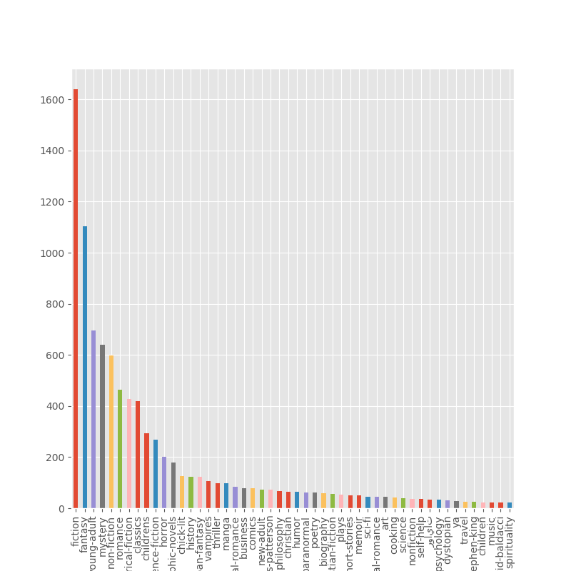
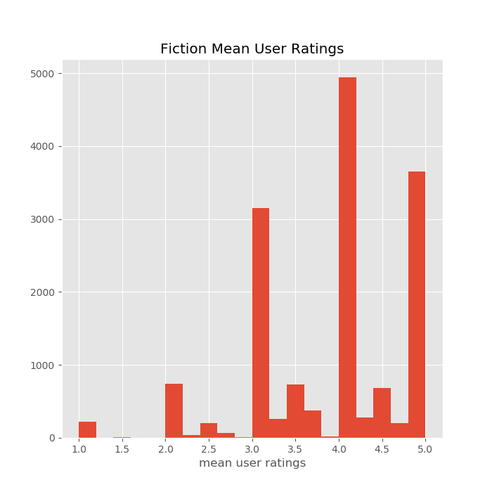
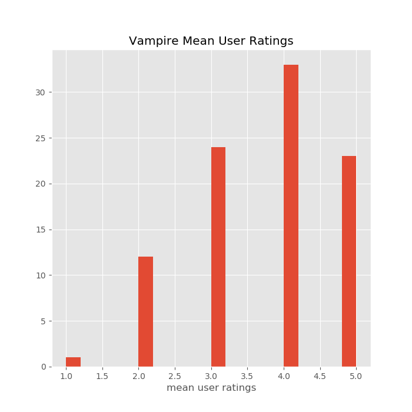
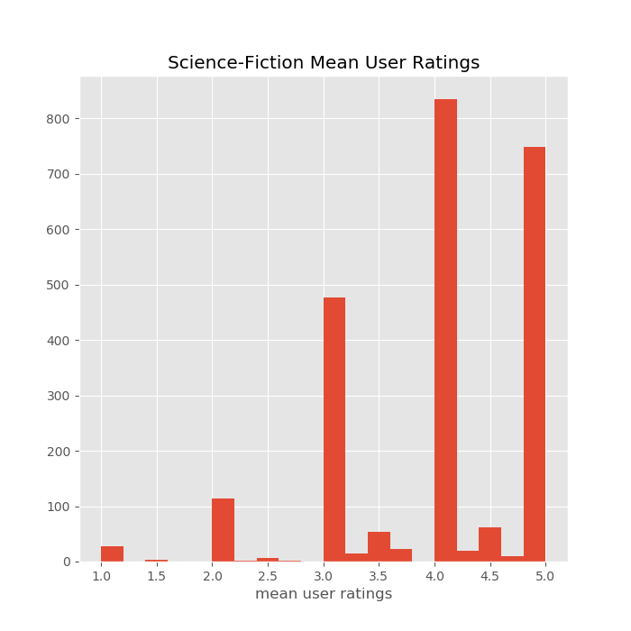

# Galvanize Capstone 1

## Table of Contents

- [Project Explanation and Goals](#project-explanation-and-goals)    
- [Baysian A/B testing](#baysian-ab-testing)        
    - [Fantasy and Fiction](#fantasy-and-fiction)        
    - [Science-Fiction and Fantasy](#science-fiction-and-fantasy)        
    - [Fiction and Vampire](#fiction-and-vampire)        
    - [Top 10 tags](#top-10-tags)    
- [Linear Regresion](#linear-regresion)        
    - [Ridge](#ridge)        
    - [Lasso](#lasso)

## Project Explanation and Goals

For this poject I decided to look at book genres and the "bleeding" between genres (the enjoyment of one genre given the enjoyment of another genre). The Goodreads 10k book dataset from kaggle seemed perfect because it countained 10k books, user reviews and user given tags. The data sets was made of four csv files, books, book_tags, ratings, and tags. My end plan is to be able to predict the raitings that someone might give any genre given their enjoyment of one genre. 

# EDA
My first step was to fiugre out how to put all of the data together so I could search through the data frame. The main problem though is the identifyer I am using are the user generated tags. (tag csv file) When just loading up theses tags, the first thing I noticed was that the majority of the tags are worthless such as to-read, favorite, --31-, and some tags writen in japanese. To deal with this I just did a quick visual search and made a function that removed the most common words I did not care about and would have messed with my analysis.
```python
def dataClean(df):
    for i in ['read', 'book', 'favorite', 'own', 'audio', 'wish-list', '--', 
    'library','buy','kindle','finish','have','audi','borrowed',
    'favourites','default']:
        mask1 = df['tag_name'].str.contains(i)
        df= df[~mask1]
    return df
```

After this I needed to find out how group the tags, books, and users so I could select specific genres and mean users reviews. My solution was to join the book_tags, and tag dataframes so that I would have tag names tied with book_ids. I then put this dataframe through my cleaning function and removed all repeate values so that I would only have one instance of every book and the tag that most people games this book. Then end result looked soemthing like this:



I then looked at the distribution of mean user reviews for the main genres I wanted to look at for this project








## Baysian A/B testing

After cleaning and orginizing my dataset, I decided that the beset way to compare genres would be through Baysian A/B testing because it can show the mean rating that users give to other genres and can give me a numerical values for how much better does one genre fan like another genre. For these experments my Null is that individuals give the same rating to any genre and my Alt is that they give differnt values.

### Fantasy and Fiction
The first two genres I compared were fantasy and fiction being the two most common book types.

```python
df_fantasy = isolate_tag(df_tags_books, 'fantasy', min_books_read)
df_fic = isolate_tag(df_tags_books, 'fiction', min_books_read)
fantasy_fic = Beta.Beta(df_fantasy, df_fic, 'user_rating').compile_analysis('Fantasy', 'Fiction', Plot=True)
plt.show()
print('A/B test, Difference in Mean Raiting', fantasy_fic)
'A/B test, Difference in Mean Raiting' [0.5153, -0.012692577030812365]
```


From running the A/B test and the Beta function produced I found that acording to the data there is almost no difference in the ratings that fans of fantasy give to fiction and vice-versa. I ended up getting that model B was better than model A about 50% of the time which once again shows no difference between the two models which makes it so I can't reject the null. This does make some sense because these two genres tend to have a lot of overlap in intrests and some individuals might consider a fantasy novel to be fiction which would definetly skew the data one way or another.

To double check the distribution of user raitings I took the difference between the average fantasy rating and the average fiction and found that on average, there is only a -.01 point difference between how individuals rate fantasy and fiction. To me this shows that if you like fiction or fantasy, you will mostlikly like the other genre equally as much.

### Science-Fiction and Fantasy

I then compared were Science-Fiction and Fantasy, which I though would be very close due to the simularity of the genres.


From this figure, it is easy to see that readers of sci-fi and fantasy tend to rate the two genres very high and they are very likly to rate the other genre as a 5 due to the lack of a right tale in either graph. Numerically I found that model B performed beter only 58% of the time compared to model A and on average there was only a raitng differnce between the genres of 0.21. These elements on top of the visual element shows that the Null can't be rejected and individuals tend to rate sci-fi and fantasy the exact same. 

### Fiction and Vampire

After seeing the results for fiction and fantasy, I decided to take a look at the genre called Vampire, which due to the vitrial around twilight and its ripoffs I though would produce intresting results, and I was right.


Acording to my code there is not a single person who has read 4 books of the fiction genre and the vampire genre. I can take this two ways, 1 that people who like either genre avoid the other, but I cannot accept this to be true. the most likley result is that my dataset and data cleaning methods are reducing the total amount of books and people in each genre. For example lets think of the fictional book, <b>Mary Popins and the Vampire Apoclypse</b>. How my code works is that it takes a look at the most used tag for each book and makes that the genre of the book, well people who might have read <b>Mary Popins and the Vampire Apoclypse</b> gave it the tags, fiction, fantasy, vampire, ya, and post-apocolyptic. If fiction was the most used tag my code would result in <b>Mary Popins and the Vampire Apoclypse</b> becoming part of the fiction genre. When I then compare ficiton and vampire, this book only counts as a fiction book and all the readers of this book count as having read a fiction book so if they have only read 2 other fiction books, or no other vampire books, they are not included when I compare the two genres against eachother.

### Top 10 tags

After having this relisations, I decided to look at how the ten most used tags compare against eachother. In order to acomplish this I seleceted the ten most used tags and then ran the resulting list through the combinations tool to produce all the combinations.

```python
def massTagComb(df, num_tag):
        df_user = df[["tag_name"]].sort_values(by=['tag_name'])
        tag_10 = df_user['tag_name'].value_counts().reset_index()
        tag_10 = tag_10.iloc[:num_tag,0]
        tag_comb = combinations(tag_10, 2)
        return tag_comb, tag_10.tolist()
```

I then ran these combinations through my code and resulted with the following values.
## temp head
|Combinations | Bleed_Over | Avg_Raiting_diff|
| ------------- |:-------------:|:-------------|
|(fiction, young-adult)|0.0000|NaN|
|(fiction, mystery)|0.0000|NaN|
|(fiction, romance)|0.0000|NaN|
|(fiction, historical-fiction)|0.0000|NaN|
|(fiction, childrens)|0.0000|NaN|
|(fantasy, young-adult)|0.0000|NaN|
|(fantasy, historical-fiction)|0.0000|NaN|
|(fantasy, childrens)|0.0000|NaN|
|(young-adult, mystery)|0.0000|NaN|
|(young-adult, non-fiction)|0.0000|NaN|
|(young-adult, childrens)|0.0000|NaN|
|(young-adult, science-fiction)|0.0000|NaN|
|(mystery, non-fiction)|0.0000|NaN|
|(mystery, romance)|0.0000|NaN|
|(mystery, childrens)|0.0000|NaN|
|(mystery, science-fiction)|0.0000|NaN|
|(non-fiction, romance)|0.0000|NaN|
|(non-fiction, childrens)|0.0000|NaN|
|(romance, historical-fiction)|0.0000|NaN|
|(romance, science-fiction)|0.0000|NaN|
|(historical-fiction, classics)|0.0000|NaN|
|(historical-fiction, childrens)|0.0000|NaN|
|(historical-fiction, science-fiction)|0.0000|NaN|
|(classics, childrens)|0.0000|NaN|
|(childrens, science-fiction)|0.0000|NaN|

Because the high amount of NaN and zeros I have to come to the conclusion that while this is a large data set, there are some fundemental flaws in it. First of all the data source is a a network for books which is sadley not as popular as movies and video games, this fact then almost self selects the users into being big fans of books alread which baises the results. On top of this, the tag system is user selected which creates a lot of uncertainty about what the genre or catagories for each book are. There are probably high level solutions to this problem such as using multiple nested dictionaries or figuring about a way to catagorise the data into genres. At this moment however I belive that my code is more of a prof of concept for calculating genre bleed over and with minimal editing could be used on differnt data sets such as amazon book sales data.

## Linear Regresion

### Ridge

### Lasso